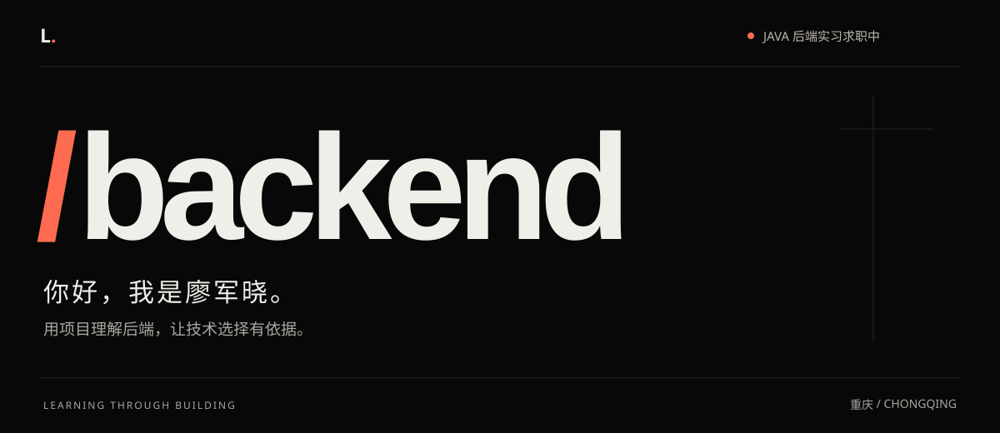
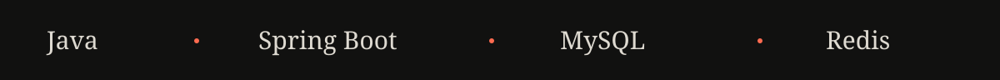
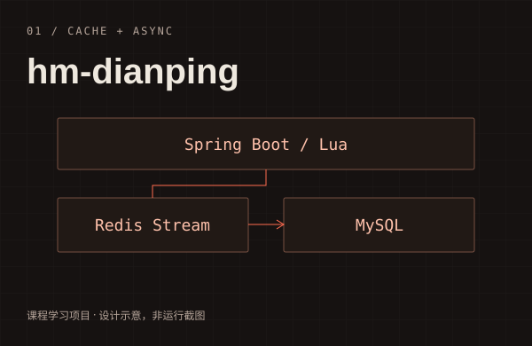
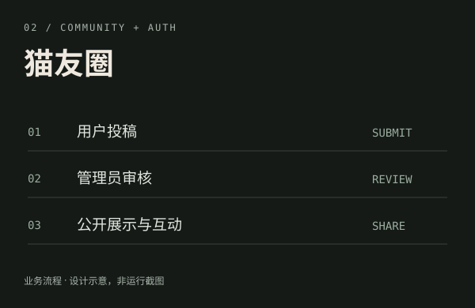
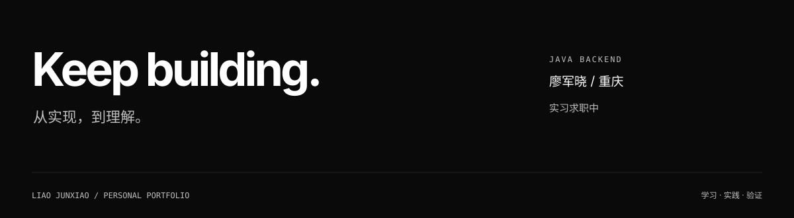

  

  

## 关于我

你好，我是**廖军晓**，目前在重庆，正在寻找 **Java 后端实习**机会。

围绕 Java、Spring Boot、MySQL 和 Redis 学习后端开发，通过项目练习接口设计、数据建模、登录鉴权、缓存与异步处理。希望把实现过程讲清楚，用代码和验证结果解释技术选择。

## 项目

<table>
  <tr>
    <td width="50%" valign="top">
      
      <h3>01 / hm-dianping</h3>
      
基于黑马点评课程的后端学习项目，包含商铺查询、优惠券秒杀、点赞与关注。

      
Java · Spring Boot · MySQL · Redis · Lua · Redis Stream

      
当前关注：缓存重建、异步订单与消息重试的正确性。

      <a href="https://github.com/goodguy123456789/hm-dianping">查看仓库 ↗</a>
    </td>
    <td width="50%" valign="top">
      
      <h3>02 / 猫友圈</h3>
      
猫咪社区项目，包含投稿审核、点赞评论、新闻管理和角色鉴权。

      
Java 17 · Spring Boot 3 · Spring Security · MyBatis-Plus · MySQL · JWT

      
当前关注：接口权限、数据建模与业务流程完整性。

      <a href="https://github.com/goodguy123456789/maoyouquan">查看仓库 ↗</a>
    </td>
  </tr>
</table>

项目封面为设计示意。项目来源、实现范围与已知问题见各仓库说明；个人独立改动清单待补充。

## 当前学习

- **缓存与一致性**：理解缓存失效、逻辑过期和并发读写的边界。
- **异步与事务**：梳理 Lua 原子操作、消息重试和订单落库流程。
- **验证与表达**：完善运行说明、异常处理与测试，记录实际完成的改动。

  
项目完善记录

当前正在梳理缓存重建、订单事务、账号状态检查与上传校验。修复完成后，将补充对应提交、验证过程和真实运行截图。

## 找到我

[GitHub · goodguy123456789 ↗](https://github.com/goodguy123456789)

  

